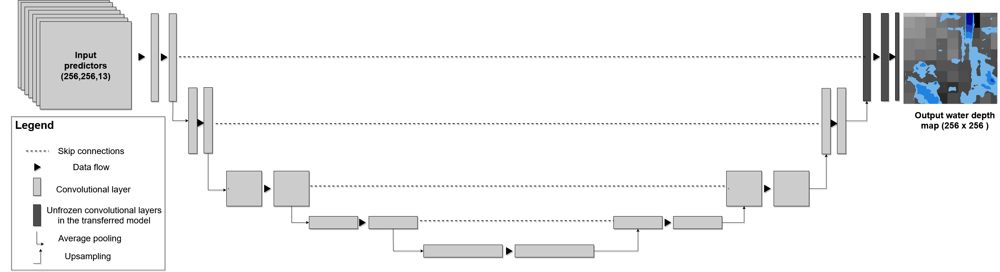
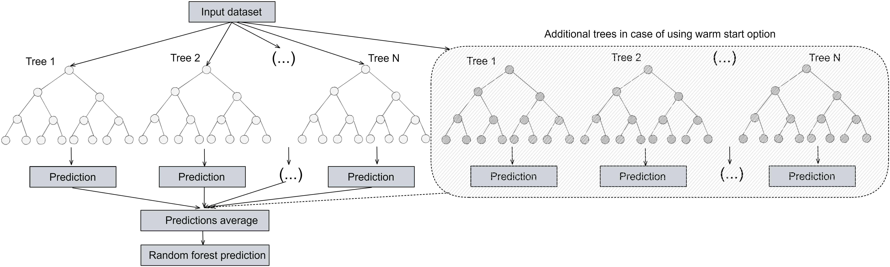

## Towards transferable data-driven models to predict urban pluvial flood water depth in Berlin, Germany

# Description

This reperository contains the code for the paper:

The calculated predictive features and the obtained water depth from the 2D hydroyanmic model are available on the following link: https://doi.org/10.5281/zenodo.7221058

# Convolutional neural network architecture

# Random forest

